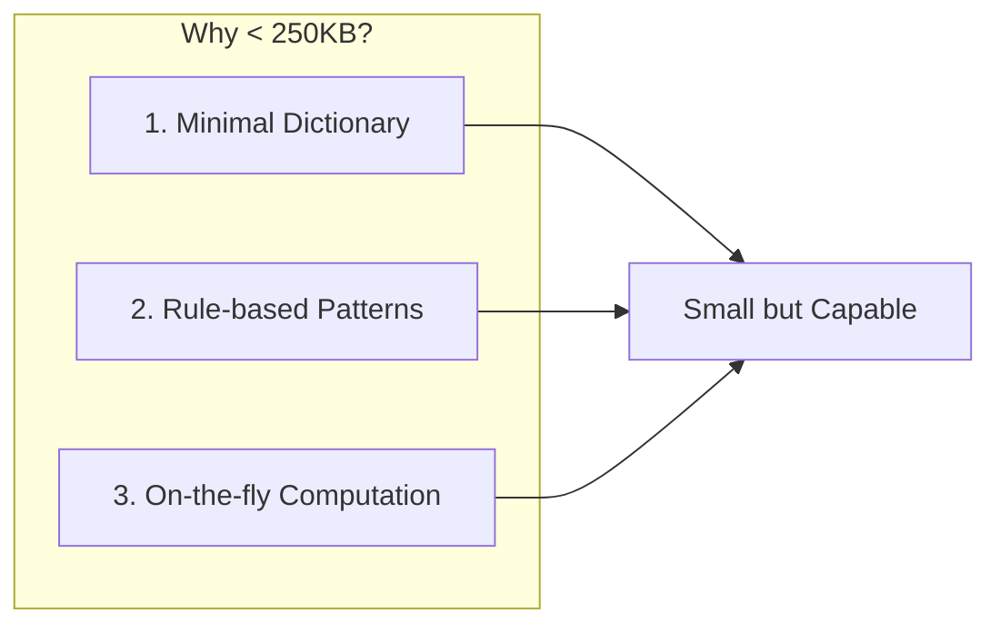
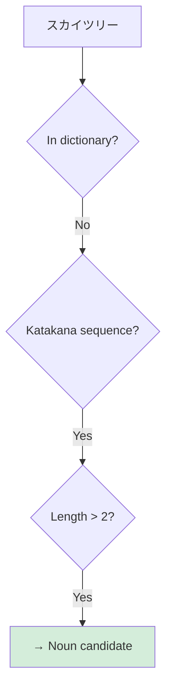
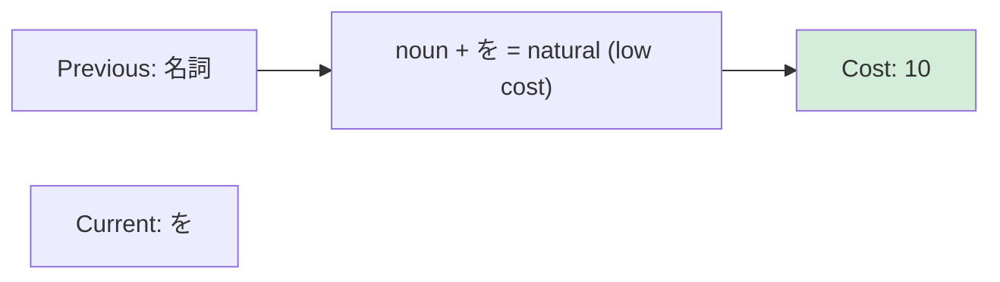
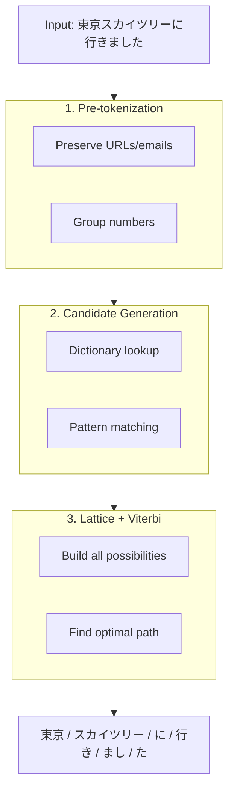

# How It Works

## Why So Small?

The biggest question: **How can Suzume tokenize Japanese text in under 250KB when MeCab needs 50MB+?**

### The Short Answer

| Traditional (MeCab) | Suzume |
|---------------------|--------|
| Stores **every word** with all metadata | Stores only **essential words** |
| Pre-computed connection costs for all word pairs | Computes connections **on the fly** |
| Requires full dictionary to handle any input | Uses **pattern rules** for unknown words |

::: tip Key Insight
MeCab's dictionary is like a phone book with every person's name. Suzume is like knowing the rules of how Japanese names are formed — you can recognize new names without listing them all.
:::

### The Three Pillars



::: info What is Tokenization?
Breaking text into meaningful units (tokens) and identifying their parts of speech. For Japanese, this means segmenting continuous text like "東京に行く" into "東京 / に / 行く".
:::

## 1. Minimal Dictionary

Traditional analyzers store exhaustive word lists:

```
# MeCab dictionary entry (simplified)
東京,noun,proper,place,*,*,*,東京,トウキョウ,トーキョー,0/3,C1
```

Suzume stores only high-frequency function words and particles. For content words, it relies on patterns.

| Category | MeCab | Suzume |
|----------|-------|--------|
| Particles (は, が, を...) | ~50 entries | ~50 entries |
| Common verbs | ~30,000 entries | ~500 entries |
| Nouns | ~200,000 entries | Pattern-based |
| Proper nouns | ~100,000 entries | Pattern-based |

## 2. Rule-based Pattern Recognition

Instead of storing every word, Suzume recognizes patterns:



| Pattern | Rule | Result |
|---------|------|--------|
| `[カタカナ]+` | Foreign loanwords are nouns | noun |
| `[漢字]+` | Kanji compounds are usually nouns | noun |
| `[漢字]+する` | Kanji + する = verbal noun | verb |
| `[ひらがな]+い` | Ending in い = adjective candidate | adjective |

::: info Why This Works
Japanese has regular patterns. Katakana words are almost always nouns (loanwords). Kanji compounds are usually nouns. This regularity lets us infer POS without storing each word.
:::

## 3. On-the-fly Computation

MeCab pre-computes a huge connection cost matrix:

```
# Which word can follow which? (simplified)
noun → particle: cost 100
noun → verb: cost 500
particle → noun: cost 50
...millions of combinations
```

Suzume computes these costs dynamically using simple rules:



## The Trade-off

::: warning Accuracy vs Size
Suzume trades ~2-3% accuracy for 99% size reduction. For most applications (search, tagging, tokenization), this trade-off is worth it.
:::

| Use Case | MeCab | Suzume |
|----------|-------|--------|
| Academic research | ✓ Best choice | △ |
| Browser apps | ✗ Too large | ✓ Best choice |
| Search indexing | ✓ | ✓ |
| Hashtag generation | ✓ | ✓ |
| Real-time UI | ✗ Needs server | ✓ |

## Technical Deep Dive

::: info What is a Lattice?
A graph structure representing all possible ways to segment text. Each path through the lattice is a potential tokenization. For "すもも", possible paths include "すもも" (plum) or "す/もも" (vinegar + peach).
:::

::: info What is Viterbi Algorithm?
A dynamic programming algorithm that finds the optimal path through the lattice. Instead of evaluating every possible combination, it efficiently finds the best segmentation by reusing previous calculations.
:::

### Analysis Pipeline



### Unknown Word Handling

When Suzume encounters an unknown word like "スカイツリー":

1. **Not in dictionary** — no stored entry
2. **Pattern match** — recognized as katakana sequence
3. **Generate candidate** — create noun hypothesis
4. **Compete in lattice** — scored against other possibilities
5. **Select best** — Viterbi finds optimal segmentation

### Verb Conjugation

Suzume recognizes 800+ conjugation patterns without storing each form:

```
Base: 食べる (to eat)
├── 食べ + ない → negative
├── 食べ + ます → polite
├── 食べ + た → past
├── 食べ + て → te-form
└── 食べ + れば → conditional
```

The rules are stored, not every conjugated form.

## Summary

| Question | Answer |
|----------|--------|
| Why is MeCab big? | Stores every word + pre-computed costs |
| Why is Suzume small? | Stores rules + minimal dictionary |
| Is accuracy affected? | ~2-3% lower, acceptable for most uses |
| When to use MeCab? | Academic research, maximum accuracy |
| When to use Suzume? | Browser apps, real-time, size-sensitive |
