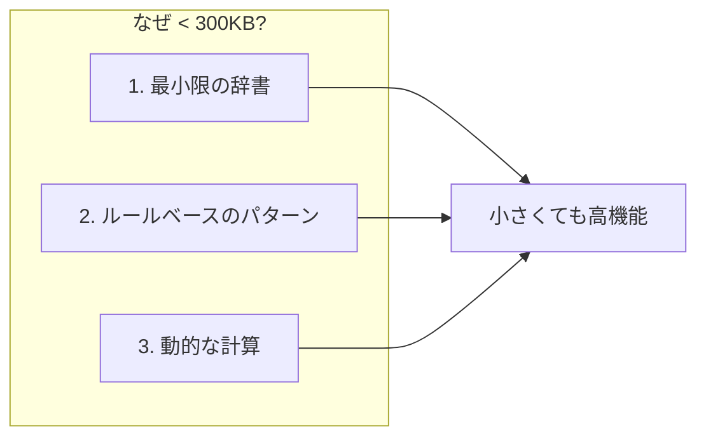
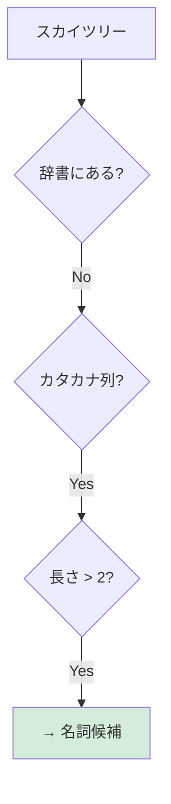
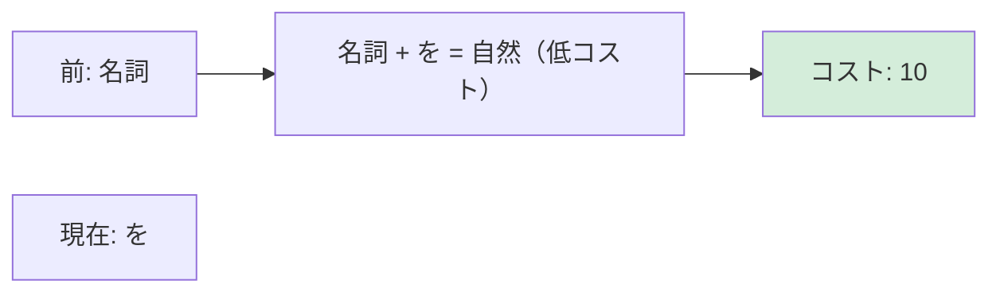
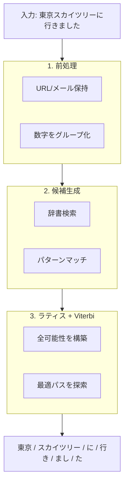

# 仕組み

## なぜこんなに小さいのか？

最大の疑問：**MeCabが50MB以上必要なのに、Suzumeはなぜ300KB以下で日本語をトークン化できるのか？**

### 簡潔な答え

| 従来（MeCab） | Suzume |
|---------------|--------|
| **すべての単語**をメタデータ付きで保存 | **必要最小限の単語**のみ保存 |
| 全単語ペアの接続コストを事前計算 | 接続コストを**動的に計算** |
| あらゆる入力に対応するため完全な辞書が必要 | 未知語は**パターンルール**で処理 |

::: tip ポイント
MeCabの辞書は「全員の名前が載った電話帳」のようなもの。Suzumeは「日本語の名前の付け方のルール」を知っている — すべての名前を登録しなくても、新しい名前を認識できます。
:::

### 3つの柱



::: info トークン化とは？
テキストを意味単位（トークン）に分割し、品詞を特定すること。日本語では「東京に行く」のような連続テキストを「東京 / に / 行く」に分割します。
:::

## 1. 最小限の辞書

従来の解析器は網羅的な単語リストを保存：

```
# MeCab辞書エントリ（簡略化）
東京,名詞,固有名詞,地域,*,*,*,東京,トウキョウ,トーキョー,0/3,C1
```

Suzumeは高頻度の機能語と助詞のみを保存。内容語はパターンに依存します。

| カテゴリ | MeCab | Suzume |
|----------|-------|--------|
| 助詞（は、が、を...） | 約50エントリ | 約50エントリ |
| 一般動詞 | 約30,000エントリ | 約500エントリ |
| 名詞 | 約200,000エントリ | パターンベース |
| 固有名詞 | 約100,000エントリ | パターンベース |

## 2. ルールベースのパターン認識

すべての単語を保存する代わりに、パターンを認識：



| パターン | ルール | 結果 |
|----------|--------|------|
| `[カタカナ]+` | 外来語は名詞 | 名詞 |
| `[漢字]+` | 漢字複合語は通常名詞 | 名詞 |
| `[漢字]+する` | 漢字 + する = サ変動詞 | 動詞 |
| `[ひらがな]+い` | 「い」で終わる = 形容詞候補 | 形容詞 |

::: info なぜこれが機能するのか
日本語には規則的なパターンがあります。カタカナ語はほぼすべて名詞（外来語）。漢字複合語は通常名詞。この規則性により、各単語を保存せずに品詞を推論できます。
:::

## 3. 動的な計算

MeCabは巨大な接続コスト行列を事前計算：

```
# どの単語がどの単語の後に来れるか？（簡略化）
名詞 → 助詞: コスト 100
名詞 → 動詞: コスト 500
助詞 → 名詞: コスト 50
...数百万の組み合わせ
```

Suzumeはシンプルなルールでこれらのコストを動的に計算：



## トレードオフ

::: warning 精度 vs サイズ
Suzumeは99%のサイズ削減と引き換えに、約2-3%の精度を犠牲にしています。ほとんどのアプリケーション（検索、タグ付け、トークン化）では、このトレードオフは価値があります。
:::

| ユースケース | MeCab | Suzume |
|--------------|-------|--------|
| 学術研究 | ✓ 最適 | △ |
| ブラウザアプリ | ✗ 大きすぎる | ✓ 最適 |
| 検索インデックス | ✓ | ✓ |
| ハッシュタグ生成 | ✓ | ✓ |
| リアルタイムUI | ✗ サーバー必要 | ✓ |

## 技術的な詳細

::: info ラティスとは？
テキストを分割するすべての可能な方法を表すグラフ構造。ラティスを通る各パスが1つのトークン化候補です。「すもも」の場合、「すもも」（李）や「す/もも」（酢＋桃）などのパスがあります。
:::

::: info Viterbiアルゴリズムとは？
ラティスを通る最適なパスを見つける動的計画法アルゴリズム。すべての可能な組み合わせを評価する代わりに、以前の計算を再利用して効率的に最適な分割を見つけます。
:::

### 解析パイプライン



### 未知語処理

Suzumeが「スカイツリー」のような未知語に遭遇した場合：

1. **辞書にない** — 登録エントリなし
2. **パターンマッチ** — カタカナ列として認識
3. **候補生成** — 名詞仮説を作成
4. **ラティスで競合** — 他の可能性とスコアリング
5. **最適選択** — Viterbiが最適な分割を発見

### 動詞活用

Suzumeは各活用形を保存せずに800以上の活用パターンを認識：

```
基本形: 食べる
├── 食べ + ない → 否定
├── 食べ + ます → 丁寧
├── 食べ + た → 過去
├── 食べ + て → て形
└── 食べ + れば → 仮定
```

各活用形ではなく、ルールが保存されています。

## まとめ

| 疑問 | 答え |
|------|------|
| なぜMeCabは大きい？ | 全単語 + 事前計算コストを保存 |
| なぜSuzumeは小さい？ | ルール + 最小辞書を保存 |
| 精度への影響は？ | 約2-3%低下、ほとんどの用途で許容範囲 |
| MeCabを使うべき時は？ | 学術研究、最大精度が必要な時 |
| Suzumeを使うべき時は？ | ブラウザアプリ、リアルタイム、サイズ重視 |
